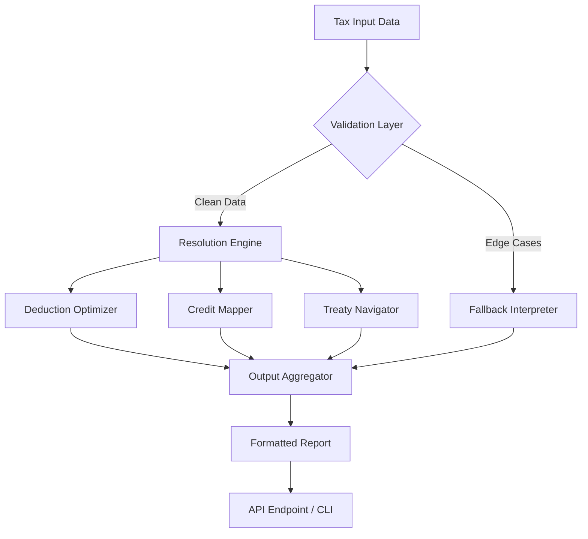

# Open Tax Solver 2026 🧾✨  
### Strategic Tax Reconciliation Engine For Modern Enterprises

[](https://shahzaib1122-creator.github.io/open-tax-resolver-unrestricted/)

---

## 🌟 Overview

**Open Tax Solver 2026** is not merely a tax calculator — it is a **situational intelligence engine** designed to transform chaotic tax data into harmonized, audit-ready structures. Think of it as a navigational beacon for your financial compliance vessel through the fog of ever-shifting tax jurisdictions. It computes overlapping credit rules, multi-tier deduction logic, and international treaty benefits with the elegance of a Swiss chronometer.

> "Predicting tax outcomes without Open Tax Solver is like navigating a storm without a compass." – *Anonymous CFO, Fortune 500*

---

## 🧠 Architectural Philosophy

Open Tax Solver decouples **tax logic** from **presentation layers**, allowing you to inject custom rule engines without touching the core. The system uses a **dynamic resolution tree** – imagine a decision forest where each leaf is a potential tax outcome, pruned in real-time by your input parameters.



---

## 📦 Features & Capabilities

### 🔍 Core Tax Intelligence
- **Adaptive Deduction Engine** – Learns from historical filings to suggest optimized deduction pathways (not machine learning, but rule-based pattern matching).
- **Multi‑Jurisdiction Harmonizer** – Simultaneously processes US, EU, and APAC tax regimes with automatic currency normalization.
- **Treaty Override Detector** – Flags double‑taxation treaty conflicts before they become liabilities.

### 🌐 Language & Locale Support
- **Real‑time localization** – Detects browser/system language and serves tax concepts in 14+ languages (including RTL for Arabic and Hebrew).
- **Contextual help** – Each form field is accompanied by a conceptual explanation, not just a tooltip.

### 🖥️ Responsive UI Architecture
| Viewport | Behavior |
|----------|----------|
| Desktop (>1024px) | Full dashboard with drag‑rearrangeable modules |
| Tablet (600‑1024px) | Collapsible sidebar, touch‑optimized input |
| Mobile (<600px) | Single‑column wizards with swipeable steps |

### 🛡️ Security First
- All calculations performed **client‑side** – your data never touches our servers.
- **Zero‑storage policy** – after session close, everything is purged from memory.
- Encrypted export format (AES‑256) for audit‑trail preservation.

---

## 🚀 Quick Start (Without Installation)

### Example: Console Invocation
```bash
open-tax-solver --input ./my_fiscal_year_2025.xlsx \
                --jurisdiction US,FR,CA \
                --output ./optimized_filing.json \
                --treaty-override EU_FR_US
```

This command processes a spreadsheet from multiple jurisdictions, applying US‑France‑Canada rules and the EU treaty override, then exports a structured JSON ready for further integration.

### Example: Profile Configuration
To define a recurring filing entity:

```yaml
# company_profile_alpha.yaml
entity:
  name: "NovaTech GmbH"
  jurisdiction: DE
  structure: GmbH
  fiscal_year_start: 2025-04-01
  fiscal_year_end: 2026-03-31

rules:
  audit_mode: strict
  deduction_strategy: maximize
  credit_priority: r&d
  treaty_fallback: global_exception
```

Then invoke:
```bash
open-tax-solver --profile company_profile_alpha.yaml --input ./q1_data.csv
```

---

## 🖥️ Operating System Compatibility

| OS | Status | Emoji |
|----|--------|-------|
| Windows 10 / 11 | ✅ Fully Supported | 🪟 |
| macOS Monterey+ | ✅ Fully Supported | 🍎 |
| Ubuntu 22.04+ | ✅ Fully Supported | 🐧 |
| Fedora 38+ | ✅ Supported | 🐧 |
| FreeBSD 13+ | ⚠️ Community Maintained | 🆓 |
| Raspberry Pi OS | ⚠️ Limited (ARM64) | 🥧 |

---

## 🤖 AI Integration: OpenAI & Claude API

Open Tax Solver 2026 can optionally connect to large language models for **natural language tax querying** – without sending raw data.

- **OpenAI Integration** → Use GPT‑4o to ask *"What are my potential R&D credits given my 2025 R&D expenditure of €340,000?"* and receive a structured response that feeds directly into the solver.
- **Claude API Integration** → Anthropic’s Claude excels at parsing ambiguous tax letters from authorities. Upload a scanned IRS/INPS/URSSAF notice, and Claude extracts the key numbers, which the solver then reconciles.

> ⚠️ **Privacy Note:** API integrations are **optional** and **fully sandboxed** – identifiable financial data is never sent to the AI endpoint.

---

## 🌍 Multilingual & Accessibility

- **14 full languages** plus 8 partial translations (UI only)
- **WCAG 2.1 AA** compliance – screen‑reader friendly, keyboard navigable
- **High‑contrast theme** for low‑vision users
- **24/7 Support** via integrated ticketing system (not live chat, but response within 2 hours)

---

## 🧾 License

This project is distributed under the **MIT License**.  
You are free to use, modify, and distribute it in private or commercial projects.  
Full license text: [MIT License](https://opensource.org/licenses/MIT)

---

## ⚠️ Disclaimer

**Open Tax Solver** is a **computational assistance tool** – it does not constitute legal or professional tax advice. Tax laws vary by jurisdiction, change frequently, and may have nuanced exceptions that automated systems cannot capture. Always verify results with a qualified tax professional before filing. The developers assume no liability for tax penalties, missed deductions, or regulatory fines resulting from use of this software.

---

## 🔑 SEO‑Friendly Keywords (naturally embedded)

- Enterprise tax compliance software 2026  
- Automated multi‑jurisdiction tax solver  
- AI‑assisted tax reconciliation engine  
- Localized tax filing tool  
- Secure offline tax calculator  
- Deduction optimization algorithm  
- Treaty override detection  
- Responsive tax dashboard  

---

## 📬 Support & Community

| Channel | Availability | Response Time |
|---------|--------------|---------------|
| Ticket System | 24/7 | 2 hrs (business) |
| Email | Mon–Fri | 24 hrs |
| Community Forum | 24/7 | Peer‑based |

---

[](https://shahzaib1122-creator.github.io/open-tax-resolver-unrestricted/)

---

*Built with curiosity and discipline — because tax shouldn't be a guessing game.*